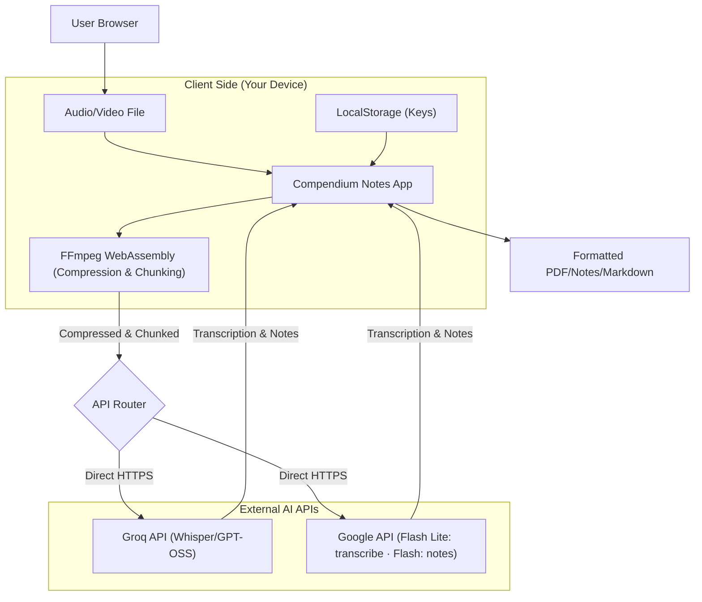

# Compendium Notes

[](https://opensource.org/licenses/MIT)
[](https://astro.build/)
[](https://reactjs.org/)
[](https://www.typescriptlang.org/)
[](https://tailwindcss.com/)

Elevate your notes using advanced AI models and BYOK security. A privacy-first web app that transforms audio recordings into structured academic notes and professional PDF edit-export capabilities. Built with **Astro**, **React**, and **TypeScript** for a blazing fast, zero-latency experience.

**BYOK Edition**: Bring Your Own Key. No subscriptions, no backend data storage, and 100% client-side processing for maximum privacy.


---

## 🌐 Live Demo

Try the application immediately: **[compendium-notes.vercel.app](https://compendium-notes.vercel.app/)**

The web application runs entirely in your browser using **client-side processing** (your audio and keys never touch a backend server).

**Security Note**:
- The web version is fully secure and safe to use with your API Keys.
- However, if you prefer maximum isolation or strict corporate compliance, you can run the application locally (`localhost`) using the installation steps below.

---

## ✨ Features

### Core Capabilities
- **100% Free & Unlimited** - No paywalls, no subscriptions. Bring your own free API keys and process as many hours as you need.
- **Dual AI Engine** - Choose between **Groq** (Extreme Speed) and **Gemini** (Massive Context & Multimodal).
- **Smart Audio Chunking** - Automatically splits long audio files (e.g., 2+ hour lectures) into optimal segments using FFmpeg, avoiding API timeouts and enabling infinite transcription length for Gemini.
- **Stuck-Model Recovery** - If a model falls into a repetition loop, the app reads the timestamp where it got stuck and re-transcribes *only* the audio from that second on, instead of losing the rest of the chunk or paying for the whole thing twice.
- **Privacy-First Architecture** - Keys and data stored exclusively in `localStorage`. Direct Browser-to-API communication. Your data never touches our servers.
- **Intelligent Transcription** - Uses **Whisper v3 Turbo** (via Groq) or **Gemini 3.5 Flash Lite** for lightning-fast, highly accurate audio-to-text.
- **AI-Powered Organization** - Automatically extracts topics, key concepts, and generates structured **Markdown** notes using intelligent prompting via **Gemini 3 Flash**.
- **Premium Export** - Download your structured notes directly into **Minimalist**, **Academic**, or **Cornell** PDF styles.
- **Built-in Audio Player** - Review your recordings while reading or editing the generated notes, with synchronized progress tracking.
- **Dark & Light Mode** - Full support for both themes with automatic system preference detection.
- **Multi-Language** - Native support for **English** and **Spanish**.

### Technology Stack
- **Frontend**: Astro (Static Shell) + React (Interactive App)
- **Styling**: Vanilla CSS + Tailwind + Framer Motion
- **State Management**: Zustand + Dexie.js (IndexedDB for persistent sessions)
- **Audio Processing**: `@ffmpeg/ffmpeg` (WebAssembly)
- **AI Integration**: Direct REST API calls to Groq & Google AI Studio

---

## ⚡ Architecture Pipeline

Real-world processing performance for a 1-hour lecture (~50MB audio):

| Provider | Model | Speed | Cost | Best For |
|----------|-------|-------|------|----------|
| **Groq** | Whisper v3 Turbo + GPT-OSS 120B | ~15-30 seconds | **Free** | Fast drafts & short meetings |
| **Gemini** | 3.5/3.1 Flash Lite (transcribe) + 3.7 Flash (notes) | ~30-45 seconds | **Free** | Long seminars, extreme accuracy |

**The Pipeline Flow:**
1. **Audio Compression**: Large files are automatically compressed locally using FFmpeg WebAssembly down to 16kHz mono (reducing 100MB files to ~10MB).
2. **Intelligent Chunking**: Anything longer than 10 minutes is split into **10-minute chunks** (FFmpeg WebAssembly). Short chunks keep each model call inside the range where it stays accurate, and a failure costs ten minutes of audio instead of an hour.
3. **Parallel Transcription**: Chunks go straight from your browser to the chosen API, several at a time — you choose how many, and the app never exceeds what the free tier allows. Responses are **streamed**, so each chunk's progress bar moves with the timestamps the model emits.
4. **Stuck-model recovery**: If a model falls into a repetition loop, the app reads the timestamp where the loop started, keeps everything transcribed before it, re-cuts the audio from that exact second and asks again for **only that stretch** — see below.
5. **Markdown Organization**: The full transcript goes back in **one large request** to a text model, which writes the title and the structured notes.
6. **Interactive Editor**: Review the transcript, edit the markdown, and export to PDF.

---

## 🏗️ Architecture



---

## 🔁 Recovering a model stuck in a repetition loop

Both engines share a well-known failure: on a long silence, a stretch of noise or
a filler word, the model latches on and repeats itself — `no, no, no, …`,
`gracias por ver el video` over and over — and never comes back. Gemini burns its
whole token budget doing it; Whisper fills the rest of the chunk with the same
segment. Either way, **the audio behind the loop was never transcribed**, and up
to twenty minutes of a lecture used to disappear without a word about it.

### What the app does now

1. **Detects the loop.** Gemini's response is streamed, so a degenerate run is
   spotted while it is being written and the socket is closed on the spot
   (`tailRepetitionRun`). Whisper does not stream, so the run is found in the
   returned segments.
2. **Reads the timestamp of the failure.** The transcript carries `[MM:SS]`
   marks written by the model itself. The resume point is the **last mark at or
   before the start of the loop** (`repetitionResumePoint`).
3. **Keeps what was good.** Everything before that mark is verified text and
   stays. The segment the loop ruined is dropped whole.
4. **Re-cuts the audio.** FFmpeg (`sliceAudio`, stream copy — no re-encoding)
   extracts the audio from that second to the end of the chunk.
5. **Asks again for that stretch only.** The retry is a normal transcription of
   a shorter file; its timestamps come back relative to the cut, and
   `shiftTimestamps` puts them back on the chunk's clock before stitching.

### Why only the damaged stretch, and not the whole chunk

This is the design decision worth writing down. Retrying the **whole chunk**
looks simpler, and it is worse on every axis:

| | Retry the whole chunk | Retry only the tail (what we do) |
|---|---|---|
| Does it fix the loop? | Often **not**: temperature is 0.1 and the audio is identical, so the model gets stuck in the same silence again | Starting at a different point changes the context and breaks the pattern that caught it |
| Verified text | Thrown away and re-rolled — the second take can come out worse | Kept |
| Token budget | The whole chunk again, when the loop had just exhausted it | A shorter file, comfortably inside the budget |
| Free-tier quota | One full request burned per attempt | One small request |

The one thing the tail-only approach needs is a place to cut, and the model's own
timestamps provide it. Cutting at a **mark** rather than at the exact character
where the repetition begins means a false positive costs one extra request but
**never costs text**: that stretch is simply transcribed again.

### Limits, on purpose

- **Two rescues per chunk.** If a model gets stuck three times on the same
  audio, the problem is the audio; a fourth request would end the same way.
- **The resume point must advance at least 5 s** over the previous one — a retry
  that jams immediately would otherwise loop forever on identical requests.
- **Tails under 20 s are not retried**: what is left fits in a sentence.
- **No timestamp before the loop, or no FFmpeg** (a browser without
  `SharedArrayBuffer`) means there is no way to cut. Then the gap is *stated* in
  the transcript — `[⚠️ The model got stuck repeating: audio missing from
  09:48 to 20:00]` — because a document that looks complete is worse than one
  with a marked hole.

The logic lives in `src/lib/loop-recovery.ts` and is shared by both providers.

---

## 🚀 Installation

### Prerequisites
- Node.js 22.12+ (required by Astro 7)
- Any package manager: npm, bun, pnpm or yarn — the repo pins none

### Quick Start

1. Clone the repository:
   ```bash
   git clone https://github.com/ForcexDev/compendium-notes.git
   cd compendium-notes
   ```

2. Install dependencies:
   ```bash
   npm install
   ```

3. Launch the development server:
   ```bash
   npm run dev
   ```

4. Access the app at `http://localhost:4321`

---

## ⚙️ Configuration

No complex setup required. The application works out-of-the-box.

### API Keys
To use the application, you will need a free API Key from:
- **Groq**: [console.groq.com](https://console.groq.com)
- **Google Gemini**: [aistudio.google.com](https://aistudio.google.com)

Enter them in the application settings (gear icon).

---

## 📸 Use Cases

- **University Students** - Record lectures and instantly get Cornell-style study notes.
- **Professionals** - Transcribe meetings and generate executive summaries and action items.
- **Researchers** - Process interviews and oral histories into searchable text.
- **Content Creators** - Convert voice memos into blog posts or structured scripts.

---

## 🔧 Troubleshooting

### "API Key Invalid"
- Ensure your key has no extra spaces.
- Verify you have selected the correct provider matching your key.

### "The model got stuck repeating" / "El modelo se atascó repitiendo"
- The app noticed a repetition loop, kept everything transcribed before it and retried the audio from that second onwards. Nothing to do: it is a notice, not an error.
- If you also see `audio missing from MM:SS`, the stretch could not be recovered — usually because the browser has no FFmpeg (`SharedArrayBuffer` blocked) or because the model got stuck twice on the same audio. That part of the recording is genuinely noisy or silent; re-uploading only that section usually works.

### "Rate Limit Exceeded" / "Resource Exhausted"
- **Groq**: Free tier has strict per-minute limits. If you hit them, wait a minute or switch provider.
- **Gemini**: If you see "Limit 0" or 429 immediately, you likely need to link a **Billing Account** (credit card) in [Google AI Studio](https://aistudio.google.com/app/plan).
  - **Important**: The "Pay-as-you-go" plan often includes a massive **Free Tier** (or effectively **Unlimited** for Gemini 3.1 Flash Lite/3 Flash, as confirmed in testing) but requires identity verification.
  - Without billing, you are on a restricted "Free of Charge" tier which may be lower.

---

## 🤝 Contributing

Contributions are welcome! Please open an issue to discuss major changes before submitting a pull request.

1. Fork the Project
2. Create your Feature Branch (`git checkout -b feature/AmazingFeature`)
3. Commit your Changes (`git commit -m 'Add some AmazingFeature'`)
4. Push to the Branch (`git push origin feature/AmazingFeature`)
5. Open a Pull Request

---

---

## 🧪 Tests

Suite de tests con [Vitest](https://vitest.dev/). Toda la red está simulada (`fetch` y `XMLHttpRequest`), así que **no consume API keys ni cuota**.

```bash
npm test          # ejecuta la suite completa
npm run test:watch
npm run check     # comprobación de tipos (astro check)
```

| Archivo | Cubre |
|---------|-------|
| `tests/unit/text-cleanup.test.ts` | Detección y limpieza de bucles de repetición del modelo, parseo de timestamps |
| `tests/unit/progress.test.ts` | Motor de progreso: ponderación por tiempo, monotonía, ETA, tablero de fragmentos |
| `tests/gemini/transcribe-standard.test.ts` | Transcripción sin fragmentar: correcta, truncada, en bucle, bloqueada |
| `tests/gemini/loop-recovery.test.ts` | Rescate de un modelo atascado: recorte desde el timestamp del fallo, límite de reintentos, hueco señalado |
| `tests/gemini/transcribe-chunked.test.ts` | Fragmentos: reintento aislado, reanudación, escalada, consolidación, presupuesto |
| `tests/gemini/transcribe-model-selection.test.ts` | Selector de modelo: modo auto con fallback y modelo fijo con reintentos sin fallback |
| `tests/gemini/api-errors.test.ts` | Catálogo de errores de la API: 400/403/404, 429 RPM y RPD, 5xx, red, subida |
| `tests/gemini/organize.test.ts` | Generación de apuntes: streaming, idioma, bucles, errores, quién redacta y con qué respaldo |
| `tests/groq/groq.test.ts` | Whisper y GPT-OSS: segmentos, límites, cadena de modelos, ventana de TPM |
| `tests/gemini/regressions.test.ts` | Fallos reales observados en producción, para que no vuelvan |
| `tests/gemini/streaming-progress.test.ts` | Streaming: avance dentro de un fragmento, metadatos por fragmento, tamaño de corte |
| `tests/ui/processing-view.test.tsx` | Pantalla de progreso: pasos, fragmentos, registro y permiso de escalada |
| `tests/ui/hero-rotator.test.tsx` | Rotador del hero: monta, es visible y rota |

El arnés vive en `tests/helpers/mock-gemini.ts` e incluye constructores para cada
error real de la API (`rateLimit()`, `dailyQuota()`, `overloaded()`, `badKey()`…),
respuestas SSE troceadas y transcripciones sintéticas.

## 📄 License

This project is licensed under the [MIT License](LICENSE).

---

**Developed by [ForcexDev](https://github.com/ForcexDev)**
